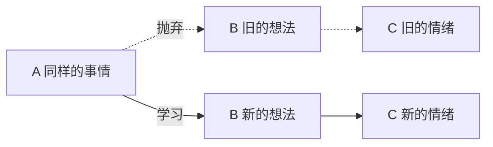

# 1. 情绪化的治标方法

# 2. 情绪产生是如何产生的

## 2.1 情绪产生的ABC模型

A（Activating event ）——激发事件

B（Belief）——认知和评价而产生的信念

C（consequence）——引发情绪和行为后果

 

## 2.2 B是情绪管理的关键

### 2.2.1 两个图片

图片中是一个怎样的人？

你看到的是什么？

### 2.2.2 两件事  

一个人坐到你的书上

一个见义勇为的保镖 	

## 2.3 有害的三种想法

* **恐怖化**

* **应该化**

* **合理化**

## 2.4 情绪管理的原理

| 事情               | 想法                                           | 情绪       |
| ------------------ | ---------------------------------------------- | ---------- |
| 约会，对方突然爽约 | 对方不守承诺，对方不重视我，我在他心中无足轻重 | 愤怒，生气 |
| 约会，对方突然爽约 | 对方有很重要的事情，他太忙了。                 |            |

# 3. 课后练习

## 3.1 互动环节

1. 请大家写下自己最近情绪比较波动的事情？

2. 请大家写下这个情绪背后的相信是什么？
3. 请思考一下是否有别的想法的可能

## 3.2